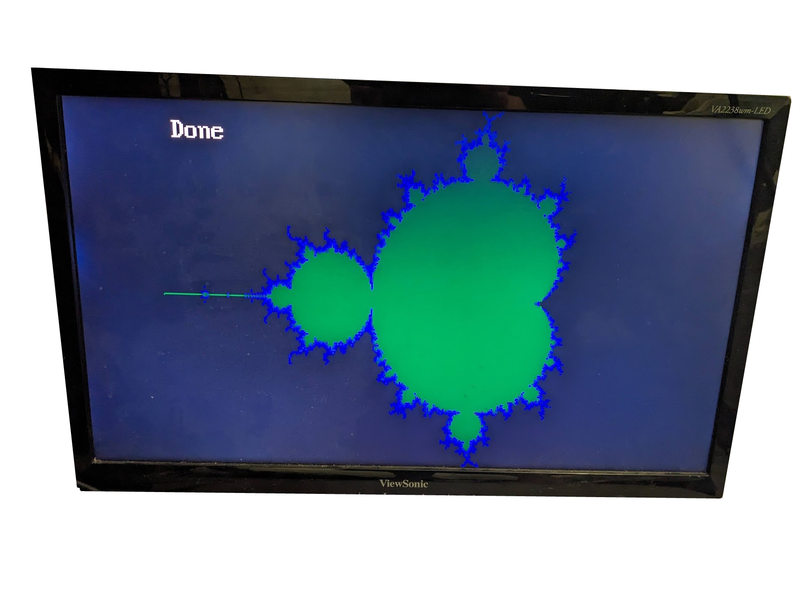
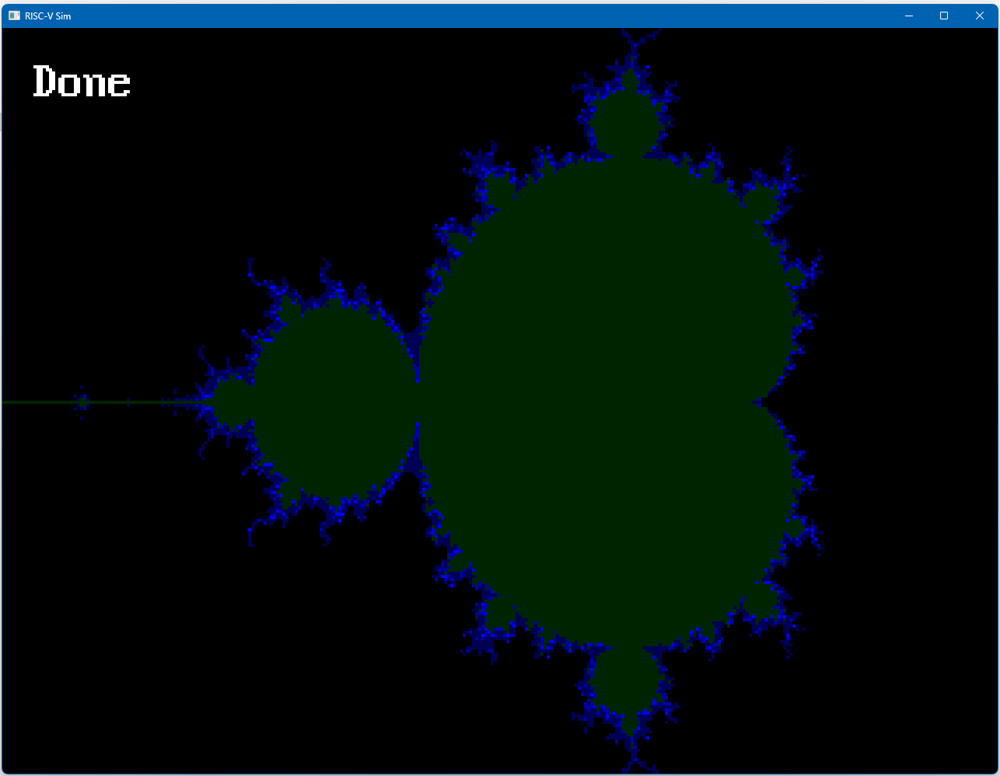

# RISC-V CPU
A CPU written in SystemVerilog implementing a subset of the RISC-V rv32i instruction set

## Building
- Run Software/build.bat to create the Memory Initialisation File (.mif)
- Compile the Quartus project and program the board (DE-10 Lite)

## Programming
To update the program: 
* Run Software/build.bat
* Open Quartus and select "Processing" -> "Update Memory Initialization File"
* Run the task "Assembler (Generate programming files)"
* Program the device

## Example Program
The default program draws the Mandelbrot set

## Emulator
I have also written an emulator to test programs. It can run the same program as the FPGA
 
 